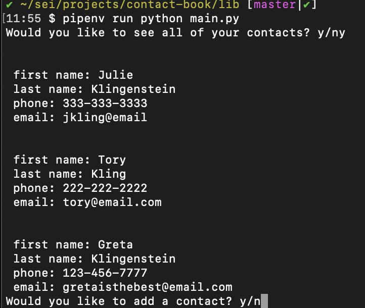

## Contact Book

This is a command line application that allows the user to access contacts stored in a SQL database.

## Created using

- Python
- SQL
- PeeWee

## Instructions

Fork and clone the repository. Install dependencies with pipenv install. In psql, create a database called 'contacts'. In the lib directory of the repository, run pipenv run python main.py.

Follow the instructions in the prompts to view all contacts, add a contact, search for a contact, update a contact, or delete a contact.

# Contribute

https://github.com/torykling/contact-book/issues
